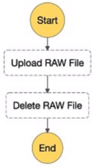
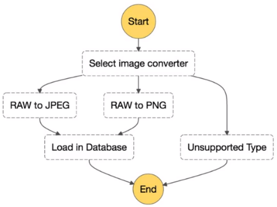
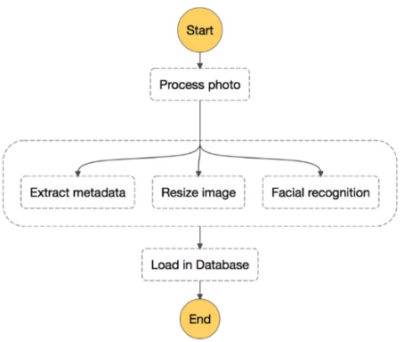

    

## Overview

- provides a graphical console to arrange and visualize the components of your application as a series of steps
- triggers and tracks each step
- retries on errors
- logs the state of each step

## Sequential Steps

## Branching Steps

## Parallel Steps

## YouTube Tutorials

- [Step Functions with Lambda](https://www.youtube.com/watch?v=s0XFX3WHg0w)
- [What are AWS Step Functions?](https://www.youtube.com/watch?v=zCIpWFYDJ8s)
- [Step Functions with DynamoDB](https://www.youtube.com/watch?v=9aE9Yjna8J0)
- [Step Functions with SQS](https://www.youtube.com/watch?v=tPYa1r_cZ2E)
- [Step Functions with SNS](https://www.youtube.com/watch?v=cuUhaBFAus4)
- [Start Step Function Workflow from Lambda](https://www.youtube.com/watch?v=kpuqc_7DQZA)
